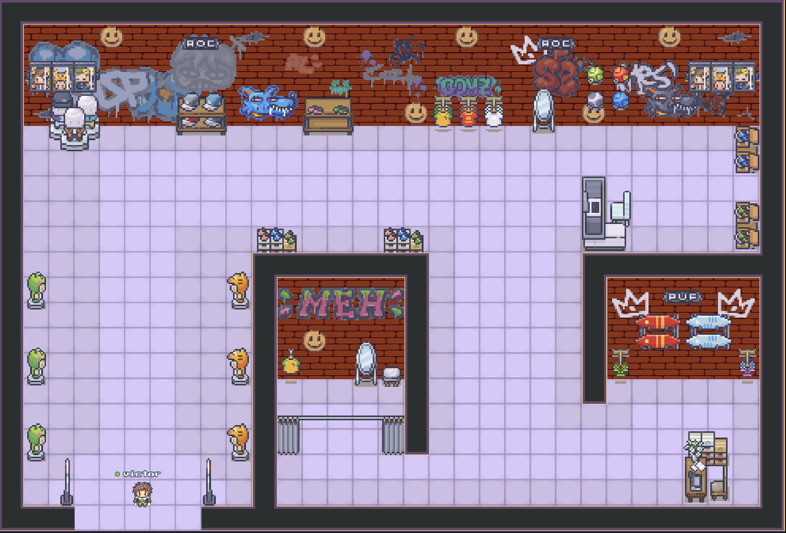
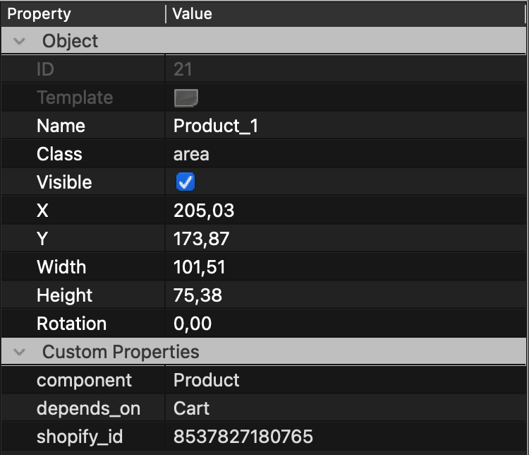

# ShopAdventure - Hackaton ESGI / ICAN / ECITV




Le projet a pour but de créer une autre canal de vente pour les personnes possédant une boutique Shopify.
Le but est de un espace en ligne où les joueurs pourront se balader et acheter des produits de A à Z sans sortir de WorkAdventure.

## Structure du projet
Le projet reprend la structure par défaut du starter-kit de WorkAdventure.
* *src*: Contient les scripts du projet
  * *zones*: Contient les composants des zones de la map (précision plus bas)
  * *api*: Contient les fichiers relatifs aux appels API d'un composant

## Installation

Pour lancer le projet en local, changer les variables d'environnement dans le fichier `.env` et lancer les commandes suivantes :
<br>(Note: pour récupérer votre clé d'API Storefront, rendez-vous sur votre page d'administration de boutique Shopify, puis dans "Canaux de vente" -> "Headless" -> "Storefront API" -> "Jeton d'accès public")
#### POUR POUVOIR TESTER LE PROJET, LES VARIABLES D'ENVIRONNEMENT SONT DÉLIBÉRÉMENT REMPLIES AVEC DE VRAIES INFORMATIONS.

```shell
npm install
npm run dev
```

## Utilisation

Pour utiliser le projet, il suffit d'ouvrir le fichier `map.tmj` dans WorkAdventure et de modifier les attributs `shopify_id` des zones pour qu'elles correspondent à votre boutique Shopify.
### Liste des zones disponibles
#### Cart
Il se place qu'une fois par map
propriétés : 
 - component: cart
#### Product
On peut en placer autant qu'on veut

propriétés : 
- (string) component: Product
- (string) shopify_id: <Id du produit sur shopify>
- (string) depends_on: Cart

triggers : 
   - popup (example de name: <NOM_PRODUCT>_trg_popup
### Fonctionnement des zones

Dans notre projet, les zones sont définies par un attribut primordial : `component`.
Cet attribut permet de définir le composant à appeler, et donc la logique à appliquer à la zone.
Le nom du composant doit correspondre au nom du fichier dans le dossier `src/zones` sans le `.ts`.

Exemple (pour le composant `Product`):


## Développeurs

| Nom        | Prénom | Liste des tâches                                                                                                      |
|------------|--------|-----------------------------------------------------------------------------------------------------------------------|
| GRANDIN    | Victor | <li>Mise en place de la boutique Shopify<li>Essais de fetch onEnter d'une zone<li>Mise en place du composant 'Produit' |
| AHMINDACHE | Jawad  | <li>Mise en place de la structure du code (et du format composant/service/api)<li>Popup dynamique sur Product<Li>Mise en place du Cart                        |
| IMAMI      | Hajar  |                                                                                                            |
